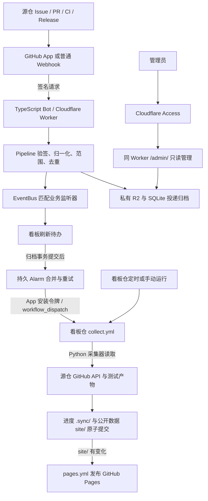

# 整体架构与当前状态

本项目由 GitHub App、TypeScript Bot、看板仓采集工作流和 GitHub Pages 组成。Webhook 提供刷新信号，GitHub API 提供项目事实；Bot 保存投递档案，看板仓保存同步进度和已采集历史。本文使用“正式／测试”等角色名，不列实际 Cloudflare 实例名称、账号、域名、资源 ID 或凭据。

## 当前状态

正式和测试 Bot 已分别运行在 Cloudflare Workers，各自只处理对应源仓、使用独立 App 与存储，并调度自己的看板。两站 Actions 已改为通过 OIDC 向对应 Worker 换取临时安装令牌；真实采集与 App 提交已验证，工作流不再读取 App 私钥。本地 Compose 已停止，旧档案卷保留且不迁移。

同 Worker 的只读管理页面和 API 已实现、部署，仍待 Cloudflare Access 应用及成员配置；配置缺失时拒绝查询，Webhook 接收和归档继续工作。管理重放已移除，内容分析监听器仍为占位。这些边界不能当成已经完成的业务能力。

## 仓库与职责

| 对象 | 职责 |
| --- | --- |
| [Bot 代码仓](https://github.com/ScienceDiscovery/sciencediscovery_bot) | TypeScript 核心、Node／Worker 适配、验签归档、事件总线、管理页面和 Actions 调度 |
| [正式源仓](https://github.com/openJiuwen-ai/sciencediscovery) | 正式 Issue、PR、代码、CI、版本与测试证据；Bot 不替它运行测试 |
| [实验源仓](https://github.com/ScienceDiscovery/sciencediscovery) | 测试 App 与测试看板联调使用的项目数据 |
| [正式看板仓](https://github.com/ScienceDiscovery/github-status-board) | 正式采集器、静态页面、工作流、同步进度与历史；发布正式 Pages |
| [测试看板仓](https://github.com/ScienceDiscovery/github-status-board-test) | 同类代码，独立的源仓映射、进度、数据、Secrets 和 Pages |

看板是静态站点，展示 Issue／PR、门禁、每日构建、版本验证、UT／ST／E2E 指标和已采集历史。浏览器读取站点 JSON，不持有 GitHub 或 Cloudflare 凭据；浏览器自定义字段仅保存在本浏览器，不回写 GitHub。两个看板仓共享功能代码，但同步代码时须保留各自 `site/`、`.sync/` 和独有修改。

## 数据链路

1. HTTP 接收原始字节，`Pipeline` 验签后解析并归一化事件，检查允许的源仓与 delivery 去重。只有有效且匹配的事件进入业务监听；未知、重复、范围外或验签失败的投递仍保存各自请求和应用响应。存储失败返回 503，不确认已保存。
2. Worker 的看板监听器仅暂存刷新意图。R2 正文／详情写入成功后，SQLite 事务一起提交索引、去重和刷新待办；随后由持久 Alarm 触发 `collect.yml`，HTTP 请求不会等待 Python 采集结束。
3. `collect.yml` 从目标 main 读取上轮进度与历史，校验唯一源仓映射，用 OIDC 向对应 Worker 换取 App 安装令牌读取 GitHub API，再将新进度与变化数据一起提交到看板仓。
4. `pages.yml` 只在 `site/` 变化或手动运行时上传整个 `site/`。仅进度变化不触发部署；页面无变化时不能把“没有新 Pages 运行”判成采集失败。

Webhook 已接受、Actions 已触发、采集提交成功、Pages 部署成功是四个独立状态。Bot 的 `last_dispatch` 只代表触发成功，最终结果分别查看采集与发布工作流。详情见[看板更新](features/board-publication.md)。

## Bot 代码与存储边界

| 位置 | 实现内容 |
| --- | --- |
| `src/core/` | 标准 Fetch／Web Crypto；`pipeline.ts` 管验签、范围和去重，`bus.ts` 管监听注册与分发，`github-app.ts` 管 App 身份，`actions.ts` 管工作流触发 |
| `src/worker/` | Worker 入口、Access 校验、SQLite Durable Object、R2 归档和持久 Alarm；不运行 Node 子进程或 Python |
| `src/node/` | 本机双端口、JSONL／文件归档、Actions 触发，以及兼容的 Python 子进程采集模式 |
| `static/index.html` | Bot 管理面板的事件记录与监听点页面；与公开 Pages 看板是两个不同界面 |
| 看板仓 `publish.py`、`gsb/`、工作流 | Python 增量采集、历史回填、测试报告解析、提交和 Pages 发布 |

私有 R2 保存请求正文及脱敏请求头／响应详情，SQLite 保存索引、计数、有限 delivery 去重窗口和刷新待办。Bot 不保存看板的历史回填游标、整套项目快照或测试日志，但会持续保存完整投递档案，因此不能把 Bot 总存储量理解成恒定的小缓存。

看板仓 `.sync/` 保存水位、回填／对账游标和指标缓存；`site/data/snapshot.json` 保存当前摘要，`site/data/history/` 保存历史分片及索引。`.sync/` 不上传到 Pages，但公开仓库中的文件仍是公开信息。旧本机 Webhook 档案不参与看板采集，不迁移不会清空已有看板历史。

同步采用增量读取、有限单轮预算、断点续跑、历史回填和周期对账，不以预览条数截断长期记录。测试报告按 run／attempt／产物缓存解析指标；只保留用例总数、通过／失败／跳过／flaky、可核验覆盖率及 GitHub 链接，不发布原始 ZIP、日志、截图或 trace。未读到的报告保持未知，不能用 job 成功推算 E2E 全部通过。数据完整性受源端权限、报告保留期和历史回填进度约束；静态站点容量仍需监测。详见[看板历史说明](https://github.com/ScienceDiscovery/github-status-board/blob/main/docs/incremental-history.md)。

## GitHub App 与凭据

Webhook secret 用于校验收到的请求；App 私钥用于签发短期 JWT，再换取指定 installation、指定仓库和权限的安装令牌；Cloudflare Access 用于管理员登录。这三种身份用途独立，不能互换。

| 操作 | 身份与权限边界 |
| --- | --- |
| 接收 App 或普通 Webhook | 校验 Webhook secret；接收本身不需要 App 私钥。普通 Webhook 同样可触发已有业务，但后续私有仓读取／工作流触发仍需独立授权 |
| Bot 触发看板采集 | 目标看板仓安装令牌：Metadata read、Actions write |
| Actions 读取源仓 | OIDC 向对应 Worker 换取源仓安装令牌：Contents、Issues、Pull requests、Actions、Checks、Commit statuses read |
| Actions 提交看板仓 | OIDC 向对应 Worker 换取目标仓安装令牌：Contents write；与跨组织源仓令牌分别申请 |
| Actions 发布 Pages | job 级 `GITHUB_TOKEN`：Contents read、Pages write、ID token write |
| Worker 部署／资源配置 | Cloudflare 的部署授权，与 GitHub App 凭据独立；不在运行时管理页或 Pages 中提供 |

App 注册权限、各组织 installation 批准的权限、Webhook 事件订阅以及 Bot 监听注册需要分别配置。只增加权限不会自动订阅新事件。新增业务通过事件总线注册，管理页读取实际注册表；慢任务自行进入持久队列，不能在接收 handler 中执行长任务。详见[事件总线](features/event-bus.md)与[接入说明](features/webhook-ingestion.md)。

App 的安装范围与 Bot 的业务范围分别管理。两套 App 可以安装到其他仓库或同时安装到同一仓库，无需收窄安装范围。各实例通过 `SDBOT_REPOS` 和看板目标映射过滤业务：验签通过的范围外业务事件返回 200、归档为 `ignored`，不进入业务监听器或触发看板刷新；`ping` 仍按协议响应。OIDC 只信任对应看板工作流，签发的令牌仍限定为配置中的源仓读取或目标看板写入权限，不随 App 安装范围扩大。

## 部署、管理与隔离调试

正式和测试使用同一份 TypeScript 源码、两份 Wrangler 配置，分别部署独立 Worker、Durable Object 命名空间、R2 和 Secrets。正式仅调度正式看板，测试仅面向实验源仓和测试看板；不能给测试实例复用正式 App 私钥。测试看板 Actions 通过 OIDC 向测试 Worker 申请临时令牌，正式看板只向正式 Worker 申请；Actions 不保存 App 私钥，两个 Worker 分别固定各自看板身份与源仓映射。两个看板仓各自只保存本站源仓映射，更新共享代码时保留配置、历史与独有功能。

Worker 的 Webhook 路径只提供协议与最小健康检查；独立 `/actions/token` 端点只接受通过 OIDC 验证的采集工作流；`/admin/` 及其 API 必须先通过 Access 签名、issuer、AUD、有效期和域名校验。它与接收服务共用部署，只提供查询，没有管理重放。Node 的管理端仅在 loopback 提供，cloudflared 只用于可选本机部署，不能转发管理端口。Worker 本身无需 cloudflared。

日常流程为本地离线测试 → 独立测试实例和测试看板联调 → 固定候选提交 → 正式发布。两套 Bot 不同时常驻调度同一看板；关闭 Cron 不等于停掉持久 Alarm，停用调度须清空对应看板目标。Bot 推送代码、Worker 发布和 Pages 发布是独立动作，不能把代码上传说成 Worker 已更新。验证与回退见[Workers 指南](features/workers.md)、[云端管理](features/cloud-admin.md)和[验证指南](testing.md)。

## 配置入 Git 与公开文档

本仓按部署配置随代码评审的方式保留 `wrangler.jsonc` 和 `wrangler.test.jsonc`，维护入口、绑定、迁移、Cron、路由与非秘密 vars。Cloudflare 推荐把 Wrangler 配置作为部署配置的权威来源；部署标识与凭据值应分别管理。此处保留已跟踪的非秘密配置，不另造一套易失配的私有配置副本。[官方配置说明](https://developers.cloudflare.com/workers/wrangler/configuration/)

App 私钥、Webhook secret、API／Tunnel token 只放 Workers Secrets 或已忽略的本地环境文件；看板 Actions 通过 [OIDC 临时凭据](features/actions-oidc.md)接入，不保留 App 私钥，不写入 Wrangler `vars`、源码、日志或文档；示例只写变量名和占位符。账号邮箱、实际账户标识和管理成员名单不纳入公开架构说明。文档使用角色名，不复制配置中的实际实例名称或访问域名。[官方 Secrets 说明](https://developers.cloudflare.com/workers/configuration/secrets/)
