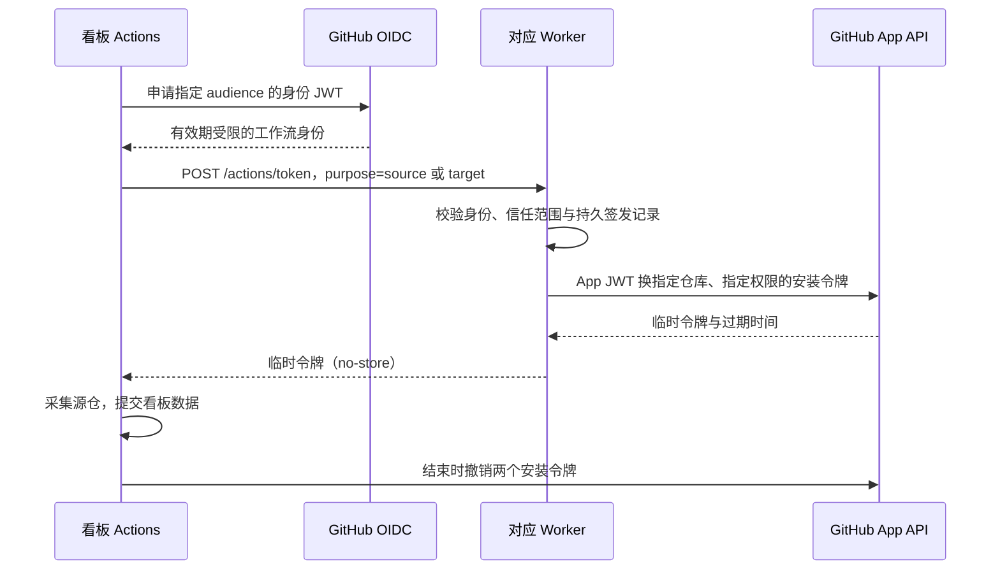

# Actions OIDC 临时凭据

## 功能与边界

App 私钥由对应环境的 Worker 管理。看板 Actions 不读取 App 私钥，启动采集后使用 GitHub 签发的 OIDC 身份向 Worker 换取两个安装令牌：源仓只读令牌、看板仓 Contents 写令牌。Bot 触发工作流所用的 Actions 写令牌只用于 dispatch，不作为工作流输入传递。

正式与测试分别使用自己的 Worker、App、信任配置与看板仓。定时、手动与 Bot 触发均走同一流程；管理 Access 登录与 Actions OIDC 是两套独立认证。

## 配置

Worker 保留 `SDBOT_GITHUB_APP_ID` 和 Secret `SDBOT_GITHUB_APP_PRIVATE_KEY`，设置唯一 `SDBOT_REPOS`／`SDBOT_BOARD_TARGETS`，以及：

| 变量 | 内容 |
| --- | --- |
| `SDBOT_ACTIONS_AUDIENCE` | 本环境独立的 OIDC audience，正式与测试不同 |
| `SDBOT_ACTIONS_REPOSITORY_ID` | 对应看板仓不可变的数字 ID |
| `SDBOT_ACTIONS_OWNER_ID` | 对应组织不可变的数字 ID |
| `SDBOT_ADMIN_HOSTNAME` | 本 Worker 的指定域名，兑换端点也限制此域名 |

信任 ID 为非秘密部署配置，随 Wrangler 配置评审；实际部署标识不复制到公开说明。看板仓设置两个 **Actions Variables**：`SDBOT_TOKEN_BROKER_URL`（对应 Worker HTTPS 地址加 `/actions/token`）、`SDBOT_TOKEN_AUDIENCE`（与 Worker 一致）。采集 job 声明 `id-token: write`，其余默认 `GITHUB_TOKEN` 仍只有 Contents read。

看板仓不再需要 `SDBOT_GITHUB_APP_ID` 或私钥 Secret。完成新链路验证后删除旧私钥 Secret；删除仓库副本不等于撤销 App 私钥，不要误撤销 Worker 正在使用的密钥。先部署支持兑换的 Worker，再更新相应看板工作流，先测试后正式。

## 接口与授权

`POST /actions/token` 使用 `Authorization: Bearer <GitHub OIDC JWT>`，JSON 请求只能包含 `purpose`，值为 `source` 或 `target`。源仓、目标仓和权限由 Worker 配置决定，客户端不能请求任意仓库或扩大权限。

- 固定 issuer 与 JWKS 地址、RS256、有效期、签发时间、audience；不跟随认证请求重定向。
- 同时校验仓库名、不可变仓库／组织 ID、`main` 分支、固定 `.github/workflows/collect.yml`、事件类型为 schedule 或 workflow_dispatch。
- subject 支持 GitHub 的原名称格式与包含不可变 ID 的格式；PR、tag、其他工作流和可复用工作流均不在当前信任范围。将来改变工作流结构需显式调整信任策略。
- 源仓令牌仅包含 Metadata、Contents、Issues、Pull requests、Actions、Checks、Commit statuses read；看板令牌仅包含 Metadata read、Contents write。跨组织分别换取 installation 令牌。
- Durable Object 原子记录仓库／run／attempt／purpose；每次运行尝试每种用途只能兑换一次。记录保留至少一天，过期记录在后续请求中清理；不保存 JWT、安装令牌或私钥。

成功返回 `token`、`expires_at`、`repository`、`purpose`，响应 `Cache-Control: no-store`。认证失败为 401，身份超出信任范围为 403，重复兑换为 409，配置不完整为 503，上游签发失败为 502。错误只返回短说明，不透传上游响应。该端点及 `/actions/` 保留路径不进入 Webhook 档案；它也不能查询管理信息。

## 采集器与失败恢复

看板仓 `collect_with_oidc.py` 从 Actions 运行环境获取 OIDC 身份，申请并立即遮蔽两个安装令牌；子进程只收到采集需要的两个令牌，不收到 OIDC 请求凭据或 App 私钥。它仍调用原有 `publish.py --incremental`，不会重置 `.sync/` 或 `site/`。

正常退出和可捕获失败都会尝试撤销已领取令牌，包含只成功领取第一个令牌的情况。Runner 被强制终止或撤销请求失败时，令牌由 GitHub 的有效期兜底。令牌不作为工作流输出、artifact 或持久缓存。

签发前先占用运行尝试的配额；上游失败或响应丢失后不允许在同一个 attempt 反复签发。使用 GitHub **Re-run jobs** 或下一个采集运行恢复，不能复用旧 OIDC 身份。失败不回退到长期私钥或个人令牌。Worker 不可用时本轮采集失败，已发布页面和历史保留。

## 验证

Bot：`npm run check`、`npm test`；`tests-ts/actions-auth.test.mjs` 在真实 workerd 中验证签名、跨环境拒绝、分支／仓库／工作流限制、最小权限、并发重复、重启后签发记录及凭据不归档。看板：`python3 -m unittest discover -s tests -v`，包含凭据隔离、撤销、部分失败、拒绝重定向及错误脱敏。实际上线还需验证 GitHub runner 的真实 OIDC 及 App 提交身份。

参考：[GitHub OIDC 身份字段](https://docs.github.com/en/actions/reference/security/oidc)、[安装令牌撤销](https://docs.github.com/en/rest/apps/installations#revoke-an-installation-access-token)。
